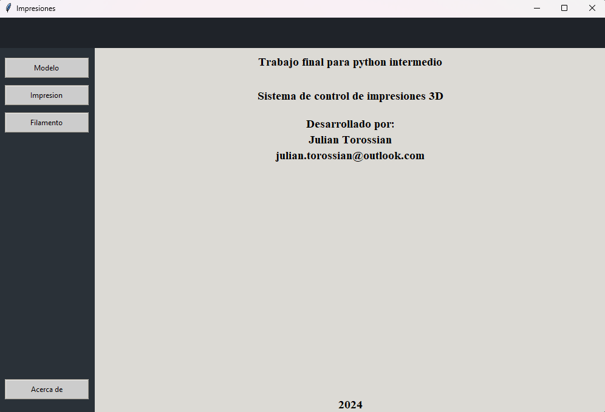
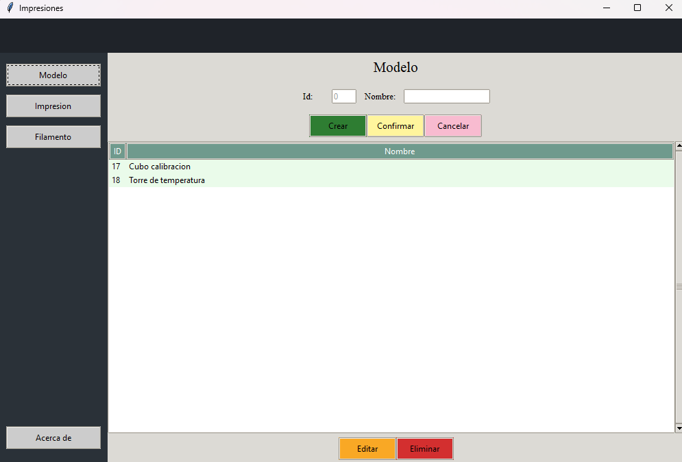
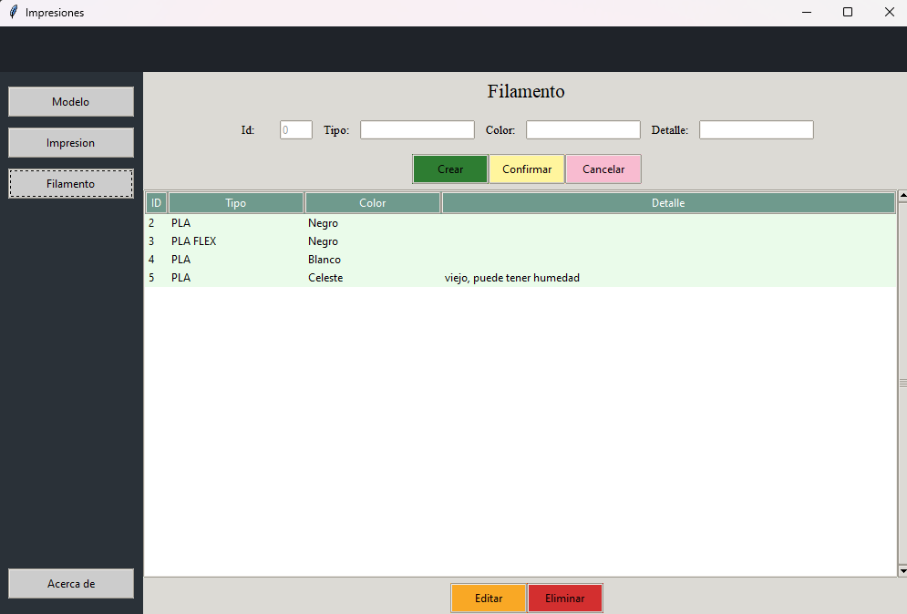
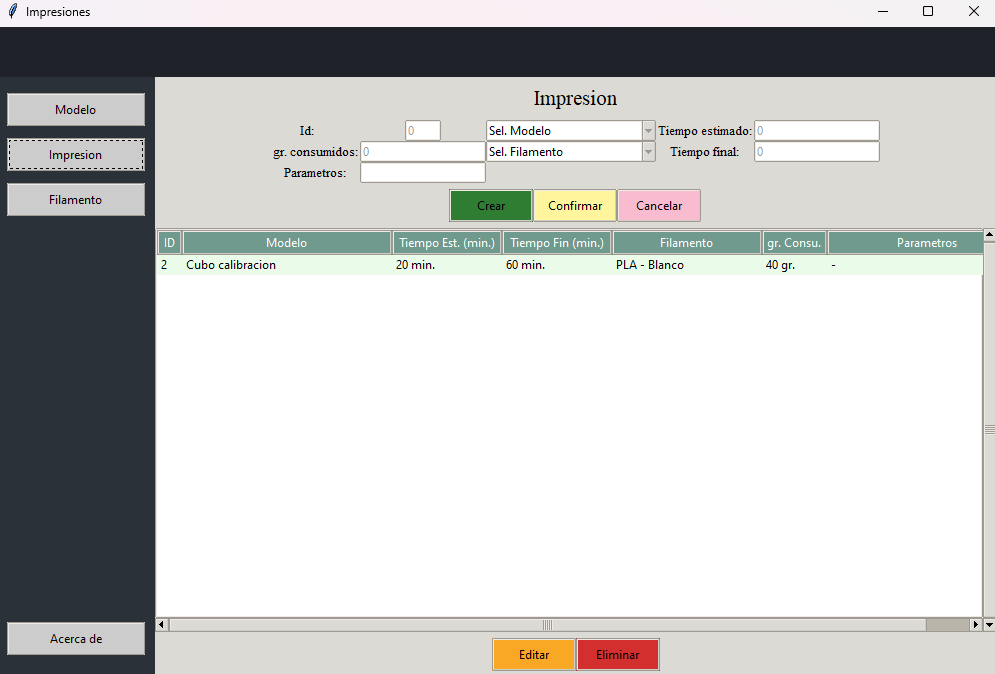

# Trabajo final - Python Intermedio

Sistema de control de impresiones 3D

En el sistema se permite guardar los modelos y los filamentos, con esto podes generar un registro de impresion para almacenar tiempos, consumos y parametros de las impresiones.

### TODO
- Poder almacenar el *gcode* de la impresion, asi en el caso de querer repetirla se podra obtener del sistema
- Poder almacenar tanto el modelo 3d como una imagen del mismo

## Ejecutar en local

Clonar el proyecto

```bash
  git clone https://github.com/juliTorossian/Impresiones_pyint.git
```

Ir al directorio del proyecto

```bash
  cd my-project
```

Ejecutar

```bash
  python main.py
```


## Capturas






- Diagrama BBDD


## Desarrollador

Julian Torossian
- [julian.torossian@outlook.com](mailto:julian.torossian@outlook.com)

